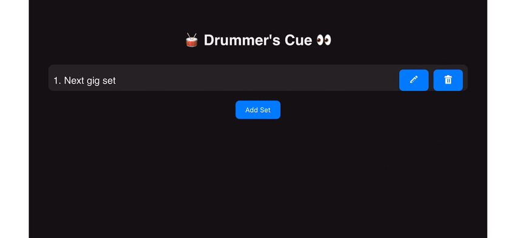

# Drummer's Cue
Visual tool for any Drummer struggling with inital song tempo.  
The whole screen blinks at the tempo you defined for each song.

Give a try to the live app here: https://the8tre.github.io/drummer-cue/



- Create and maintain your gigs set lists
- Add as many song as you want per set list
- Specify the tempo fo each song
- Optionally provide a duration after which the player will automatically to the next song
- Click/touch the right/left of Player screen to the jump to the next/previous song of the set list
- Click/touch the center of the Player to get back to the set list sreen
- Set lists are persisted into you browser local storage

## Next steps
- Setlists export/import for long term storage and backup 

## Development server
This project was generated using [Angular CLI](https://github.com/angular/angular-cli) version 20.0.2.
To start a local development server, run:

```bash
ng serve
```

Once the server is running, open your browser and navigate to `http://localhost:4200/`. The application will automatically reload whenever you modify any of the source files.

## Code scaffolding

Angular CLI includes powerful code scaffolding tools. To generate a new component, run:

```bash
ng generate component component-name
```

For a complete list of available schematics (such as `components`, `directives`, or `pipes`), run:

```bash
ng generate --help
```

## Building

To build the project run:

```bash
ng build
```

This will compile your project and store the build artifacts in the `dist/` directory. By default, the production build optimizes your application for performance and speed.

## Running unit tests

To execute unit tests with the [Karma](https://karma-runner.github.io) test runner, use the following command:

```bash
ng test
```

## Running end-to-end tests

For end-to-end (e2e) testing, run:

```bash
ng e2e
```

Angular CLI does not come with an end-to-end testing framework by default. You can choose one that suits your needs.

## Additional Resources

For more information on using the Angular CLI, including detailed command references, visit the [Angular CLI Overview and Command Reference](https://angular.dev/tools/cli) page.
